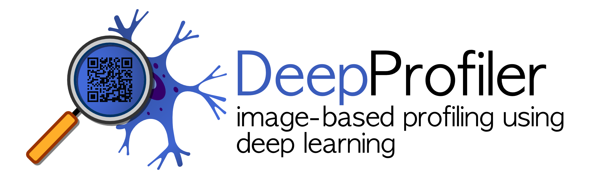
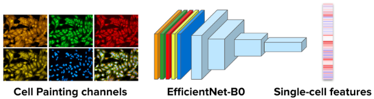
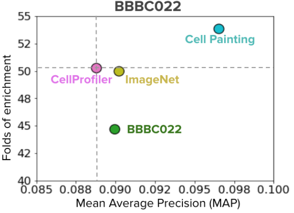

-----------------
[](https://www.python.org/downloads/)
[](https://github.com/cytomining/DeepProfiler/actions/workflows/integration-test.yml)
[](https://codecov.io/gh/cytomining/DeepProfiler)
[](https://doi.org/10.5281/zenodo.7114558)
[](https://doi.org/10.5281/zenodo.7515132)

# Image-based profiling using deep learning 

DeepProfiler is a set of tools to use deep learning for analyzing imaging data in high-throughput biological experiments.
Please, see our [DeepProfiler Handbook](https://cytomining.github.io/DeepProfiler-handbook/) for more details about how 
to use it and [DeepProfilerExperiments repository](https://github.com/broadinstitute/DeepProfilerExperiments) 
for the examples of configuration files and downstream analysis.

Checkout our Nature Communications [paper](https://www.nature.com/articles/s41467-024-45999-1).

# Cell Painting CNN

<p align="center">

</p>

[_**Cell Painting CNN weights are available on Zenodo.**_](https://doi.org/10.5281/zenodo.7114558)

We used DeepProfiler to train a feature extraction model for single cells in Cell Painting experiments. 
The model brings state-of-the-art profiling performance for downstream analysis tasks. This model is an EfficientNet 
trained to process the 5 channels of the Cell Painting assay and produce single-cell morphology embeddings, which can 
be aggregated to profile treatments in large-scale experiments. Features obtained with the Cell Painting CNN are more 
robust and improve performance.

<p align="center">

</p>

# Quick Guide

## System requirements

- Python 3.10+ is required.
- Linux (Ubuntu 20.04+) or macOS.
- For GPU acceleration, a CUDA-compatible GPU is recommended.

## Install

```
pip install deepprofiler
```

For contributing, see [CONTRIBUTING.md](CONTRIBUTING.md).

## Download example data

This repository contains example data structured as a DeepProfiler project.
Unpack it with:
```
tar -xzf example_data.tar.gz
```

## Profiling with the Cell Painting CNN-1

Initialize your project directory structure:
```
deepprofiler --root=/path/to/project --config=config.json setup
```

Place your images, metadata CSV, and cell locations in the created directories
(see the [handbook](https://cytomining.github.io/DeepProfiler-handbook/docs/02-structure.html) for layout details).
[Download an example configuration file](https://github.com/broadinstitute/DeepProfilerExperiments/blob/master/resources/config/cell_painting_cnn_profiling_example.json)
and put it in `project/inputs/config/`.

Copy the model weights (`Cell_Painting_CNN_v1.hdf5`,
[available on Zenodo](https://doi.org/10.5281/zenodo.7114558)) into `project/outputs/cell_painting/checkpoint/`.

Run feature extraction:
```
deepprofiler --root=/path/to/project --config=cell_painting_cnn.json --exp=cell_painting --gpu=0 profile
```

Extracted features are written to `project/outputs/cell_painting/features/`.

## Training your own models

If you are interested in training a model on your images, please follow the [instructions in our
documentation handbook](https://cytomining.github.io/DeepProfiler-handbook/docs/07-train.html).

**Happy profiling!**
