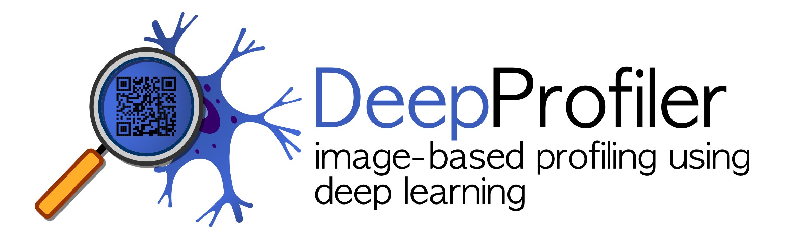

-----------------
[](https://www.python.org/downloads/release/python-360/)
[](https://www.tensorflow.org/install/pip)
[](https://doi.org/10.5281/zenodo.7114558)
[](https://doi.org/10.5281/zenodo.7515132)
[](https://www.comet.ml)

# Image-based profiling using deep learning 

DeepProfiler is a set of tools to use deep learning for analyzing imaging data in high-throughput biological experiments.
Please, see our [DeepProfiler Handbook](https://cytomining.github.io/DeepProfiler-handbook/) for more details about how 
to use it and [DeepProfilerExperiments repository](https://github.com/broadinstitute/DeepProfilerExperiments) 
for the examples of configuration files and downstream analysis.

Checkout our [preprint](https://doi.org/10.1101/2022.08.12.503783) on bioRxiv.

# Cell Painting CNN-1

<p align="center">

</p>

[_**Cell Painting CNN weights are available on Zenodo.**_](https://doi.org/10.5281/zenodo.7114558)

We used DeepProfiler to train a feature extraction model for single cells in Cell Painting experiments. 
The model brings state-of-the-art profiling performance for downstream analysis tasks. This model is an EfficientNet 
trained to process the 5 channels of the Cell Painting assay and produce single-cell morphology embeddings, which can 
be aggregated to profile treatments in large-scale experiments. Features obtained with the Cell Painting CNN-1 are more 
robust and improve performance.

<p align="center">

</p>

# Quick Guide

## System requirements

DeepProfiler works best with Linux operating systems (Ubuntu 18+).
- Python 3.6+ is required.
- Tensorflow 2.5.3 (tested). 
- For GPU-acceleration a CUDA-compatible (CUDA 11.2) graphic card is required. 
  Also see [Tensorflow-CUDA-Python compatibility table](https://www.tensorflow.org/install/source#gpu). 

## Clone and install DeepProfiler

First, clone or fork this repository with example data (example data is stored with `git-lfs`):
```
git clone https://github.com/broadinstitute/DeepProfiler.git
```
Alternativly, you can [download example data from Zenodo](https://doi.org/10.5281/zenodo.7515132). 

If you don't need example data, you can clone without it:
```
GIT_LFS_SKIP_SMUDGE=1 git clone https://github.com/broadinstitute/DeepProfiler.git
```

Then [install](https://cytomining.github.io/DeepProfiler-handbook/docs/01-install.html) it using:
```
pip install -e .
```

## Download example data

This repository contains example data, which is already structured as a DeepProfiler project. 
To do this, unpack `example_data.tar.gz` with the command:
```
tar -xzf example_data.tar.gz
```
Profiling of the example data with GPU-acceleration is expected to take ~1 minute. 
Single-cell export and training are expected to take 5-10 minutes. 

## Profiling with the Cell Painting CNN-1

To profile experimental data, just an experiment folder, for example, `cell_painting` in `example_data/outputs/` and 
then `checkpoint` folder inside the created experiment folder. Copy model file `Cell_Painting_CNN_v1.hdf5` into `checkpoint` folder.

[Download an example configuration file](https://github.com/broadinstitute/DeepProfilerExperiments/blob/master/resources/config/cell_painting_cnn_profiling_example.json) 
and put it in `example_data/inputs/config/`.

Now you can start profiling the example data:
```
python3 deepprofiler --root=/your_path/example_data/ --config=cell_painting_cnn_profiling_example.json –-exp=cell_painting –-gpu=0 profile
```

The extracted features should be available in `example_data/outputs/cell_painting/features/`.

### Profiling with the Cell Painting CNN-1 with your data

When running DeepProfiler you usually need to specify a root directory where your data is stored and a command that you 
want to run. For instance, to [initialize](https://cytomining.github.io/DeepProfiler-handbook/docs/02-structure.html) 
your project, you can use:

```
python deepprofiler --root=/home/ubuntu/project --config=config.json setup
```

In the created directories, you can organize your input files, including [images](https://cytomining.github.io/DeepProfiler-handbook/docs/03-images.html), 
[metadata and single-cell locations](https://cytomining.github.io/DeepProfiler-handbook/docs/04-metadata.html). You can 
also refer to example data regarding the project organization and format of files. 


[Download an example configuration file](https://github.com/broadinstitute/DeepProfilerExperiments/blob/master/resources/config/cell_painting_cnn_profiling_example.json) 
and put it in your `project/inputs/config/`. Adjust the configuration for your project: more details about configuration 
files are available in the corresponding [handbook chapter](https://cytomining.github.io/DeepProfiler-handbook/docs/05-config.html) 
and [profiling section](https://cytomining.github.io/DeepProfiler-handbook/docs/06-profiling.html#profiling-with-cell-painting-cnn-model). 
Also, you can find other examples in the [DeepProfilerExperiment repository](https://github.com/broadinstitute/DeepProfilerExperiments).

After you organize your project, create an experiment folder (for example `cell_painting`) in `project/outputs/` and then 
a `checkpoint` folder inside the created experiment folder. Copy the model (`Cell_Painting_CNN_v1.hdf5`) into the `checkpoint` folder.

If images are in `project/inputs/images/`, set `implement:false` in the `compression` config section.


After the project is organized, feature extraction can be started:
```
python3 deepprofiler --root=/project/ --config=cell_painting_cnn.json –-exp=cell_painting –-gpu=0 profile
```

## Training of your models

If you are interested in training a model on your images, please follow the [instructions in our 
documentation handbook](https://cytomining.github.io/DeepProfiler-handbook/docs/07-train.html). 

**Happy profiling!**
